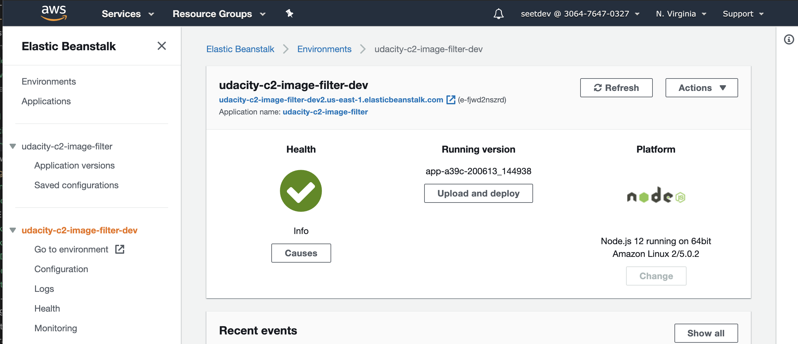

# Udagram Image Filtering Microservice

Udagram is a simple cloud application developed alongside the Udacity Cloud Engineering Nanodegree. It allows users to register and log into a web client, post photos to the feed, and process photos using an image filtering microservice.

The Application is split into three parts:
1. [The Simple Frontend](https://github.com/udacity/cloud-developer/tree/master/course-02/exercises/udacity-c2-frontend)
A basic Ionic client web application which consumes the RestAPI Backend. [Covered in the course]
2. [The RestAPI Backend](https://github.com/udacity/cloud-developer/tree/master/course-02/exercises/udacity-c2-restapi), a Node-Express server which can be deployed to a cloud service. [Covered in the course]
3. [The Image Filtering Microservice](https://github.com/udacity/cloud-developer/tree/master/course-02/project/image-filter-starter-code), the final project for the course. It is a Node-Express application which runs a simple script to process images.

For this project, the code for performing the Image Filtering Microservice is completed. And the service is deployed to AWS Elastic Beanstalk.

## Repository

Github Url: https://github.com/seetdev/cdnd-p2

## Tasks

### Setup Node Environment

You'll need to create a new node server. Open a new terminal within the project directory and run:

1. Initialize a new project: `npm i`
2. run the development server with `npm run dev`

### Create a new endpoint in the server.ts file

A new endpoint `filteredimage` that accepts a url to an image to perform filtering is added to `./src/server.ts`.

### Deploying the Microservice

#### `npm run build`

The first step is to build the Microservice into an archive that can be deployed by running `npm run build`

``` bash
(base) MBP-C02ZC3X8LVDM:cdnd-p2 xxxxx$ npm run build

> udacity-c2-image-filter@1.0.0 build /xxxxx/udacity-cloud-developer-nanodegree/cdnd-p2
> npm run clean && tsc && cp package.json www/package.json && mkdir www/tmp/ && cd www && zip -r Archive.zip . && cd ..


> udacity-c2-image-filter@1.0.0 clean /xxxxx/udacity-cloud-developer-nanodegree/cdnd-p2
> rm -rf www/ || true

  adding: util/ (stored 0%)
  adding: util/util.js (deflated 60%)
  adding: util/util.js.map (deflated 56%)
  adding: server.js (deflated 61%)
  adding: server.js.map (deflated 66%)
  adding: package.json (deflated 54%)
  adding: tmp/ (stored 0%)
```

#### `eb init`

The second step is to execute `eb init` in the project folder to initialize a new application on AWS Elastic Beanstalk.

```bash
(base) XXXXX:udacity-c2-image-filter xxxxx$ eb init
Select a default region
1) us-east-1 : US East (N. Virginia)
2) us-west-1 : US West (N. California)
3) us-west-2 : US West (Oregon)
4) eu-west-1 : EU (Ireland)
5) eu-central-1 : EU (Frankfurt)
6) ap-south-1 : Asia Pacific (Mumbai)
7) ap-southeast-1 : Asia Pacific (Singapore)
8) ap-southeast-2 : Asia Pacific (Sydney)
9) ap-northeast-1 : Asia Pacific (Tokyo)
10) ap-northeast-2 : Asia Pacific (Seoul)
11) sa-east-1 : South America (Sao Paulo)
12) cn-north-1 : China (Beijing)
13) cn-northwest-1 : China (Ningxia)
14) us-east-2 : US East (Ohio)
15) ca-central-1 : Canada (Central)
16) eu-west-2 : EU (London)
17) eu-west-3 : EU (Paris)
18) eu-north-1 : EU (Stockholm)
19) eu-south-1 : EU (Milano)
20) ap-east-1 : Asia Pacific (Hong Kong)
21) me-south-1 : Middle East (Bahrain)
22) af-south-1 : Africa (Cape Town)
(default is 3): 3

You have not yet set up your credentials or your credentials are incorrect 
You must provide your credentials.
(aws-access-id): AHIOUAHDUIHFIQHIWU
(aws-secret-key): ACSJFJOIQJFIO2378975hadhsuaidh/g2%*A%#hsd

Enter Application Name
(default is "udacity-c2-image-filter"): 
Application udacity-c2-image-filter has been created.

It appears you are using Node.js. Is this correct?
(Y/n): 
Select a platform branch.
1) Node.js 12 running on 64bit Amazon Linux 2
2) Node.js 10 running on 64bit Amazon Linux 2
3) Node.js running on 64bit Amazon Linux
(default is 1): 1

Cannot setup CodeCommit because there is no Source Control setup, continuing with initialization
Do you want to set up SSH for your instances?
(Y/n): 

Select a keypair.
1) udacity-keypair
2) [ Create new KeyPair ]
(default is 1): 1
```

#### Modify `.elasticbeanstalk\config.yml`

 Add the following to `.elasticbeanstalk\config.yml`

 ```bash
deploy:
  artifact: ./www/Archive.zip
 ```

#### `eb create`

The next step is to execute `eb create` in the project folder to create an environment and deploy the application o AWS Elastic Beanstalk.

```
(base) MBP-C02ZC3X8LVDM:cdnd-p2 xxxxxx$ eb create
Enter Environment Name
(default is udacity-c2-image-filter-dev): 
Enter DNS CNAME prefix
(default is udacity-c2-image-filter-dev2): 

Select a load balancer type
1) classic
2) application
3) network
(default is 2): 2


Would you like to enable Spot Fleet requests for this environment?
(y/N): N
Uploading udacity-c2-image-filter/app-a39c-200613_141217.zip to S3. This may take a while.
Upload Complete.
Environment details for: udacity-c2-image-filter-dev
  Application name: udacity-c2-image-filter
  Region: us-east-1
  Deployed Version: app-a39c-200613_141217
  Environment ID: xxxxxxxx
  Platform: arn:aws:elasticbeanstalk:us-xxxx-1::platform/Node.js 12 running on 64bit Amazon Linux 2/5.0.2
  Tier: WebServer-Standard-1.0
  CNAME: udacity-c2-image-filter-dev2.us-xxxx-1.elasticbeanstalk.com
  Updated: 2020-06-13 18:12:22.329000+00:00
Printing Status:
2020-06-13 18:12:20    INFO    createEnvironment is starting.
2020-06-13 18:12:22    INFO    Using elasticbeanstalk-us-xxxx-1-xxxxx as Amazon S3 storage bucket for environment data.
  ...
  ...
2020-06-13 18:16:38    INFO    Successfully launched environment: udacity-c2-image-filter-dev
```

### Elastic Beanstalk Endpoint URL

URL: http://udacity-c2-image-filter-dev2.us-east-1.elasticbeanstalk.com

#### Example Usage

http://udacity-c2-image-filter-dev2.us-east-1.elasticbeanstalk.com/filteredimage?image_url=https://www.google.com/images/branding/googlelogo/2x/googlelogo_color_92x30dp.png

### Elastic Beanstalk Status


